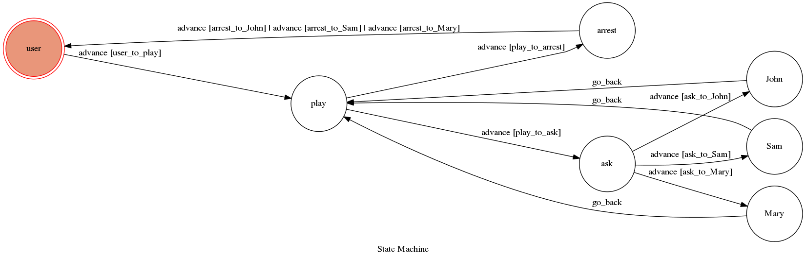

# Theory Of Computation Project 2017

It's a telegram bot based on a finite state machine

## Setup

### Requirement
* Python 3

#### Run the sever

```sh
python3 app.py
```
### Run
Run Telegram, find bot @SunSJ

## Finite State Machine


## Usage
The initial state is set to `user`.
Type `/play` to triggered to `play` state.
* user
    * Input: "/play"
        * Go to play state
        * Input "ask"
            * Input "'name' to get some useful information"
                * Go back to play state
        * Input "arrest"
            * Input "'name' to arrest them."
                * Go back to user state.

## Author
[SunSJ](https://github.com/F74045042)
