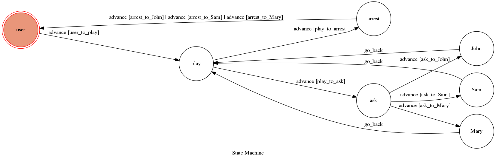

# Theory Of Computation Project 2017

It's a telegram bot based on a finite state machine.
<p>
有一位有錢人在房裡被殺害了，警方經過一番努力搜查，將John, Sam, Mary三位嫌疑犯抓了起來。
得知他們的證詞後，需要由你來破解這樁密室殺人案件！這是一款邏輯思考遊戲，誰才是真正的兇手？

## Setup

### Requirement
* Python 3

#### Run the sever

```sh
python3 app.py
```
### Run
Run Telegram, find bot @SunSJ

## Finite State Machine


## Usage
The initial state is set to `user`.
Type `/play` to triggered to `play` state.
* user
    * Input: "/play"
        * Go to play state
        * Input "ask"
            * Input "'name' to get some useful information"
                * Go back to play state
        * Input "arrest"
            * Input "'name' to arrest them."
                * Go back to user state.

## Author
[SunSJ](https://github.com/F74045042)
